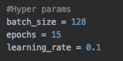
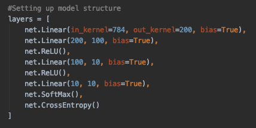
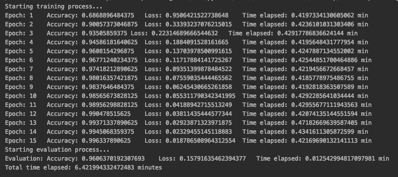
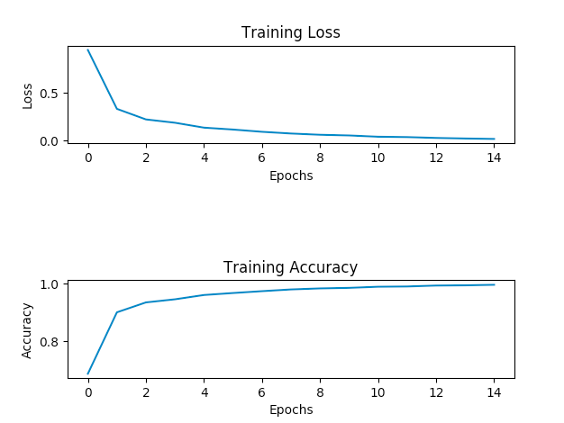

## Deep Learning Final Project

To use project make sure to:

1. pip install -r /path/to/requirements.txt
2. If mnist.pkl is not in folder run download_mist.py 
3. Run main.py
#
#### <ins>Abstract</ins>

This project aims to manually implement a fully-connected 
neural network without the use of any deep learning libraries 
like Tensorflow and PyTorch. The neural network must be trained and 
evaluated using the MNIST data set while achieving an accuracy of over 90%.

#
#### <ins>Example Sequential Network</ins>

 Below is the fully connected network I used to complete the project. 
 It had a total of 4 fully connected layers with 2 of the hidden layers being
 followed by ReLU activation functions. The output layer uses a softmax activation function with
 an output size of 10 to give a probability distribution that represents
 the probability of the input image being one of the single digit values
 in the MNIST data set (0 through 9). This probability distribution is passed
 into a cross entropy loss functions to provided the network with a loss value. All layer weights are initialized 
 using Xavier uniform initialization and weight updates are done using 
 the stochastic gradient descent method without using a weight decay nor momentum value.
 
 

 
 
 

 

#

 ### <ins>Some Things I Would Like To Add</ins>

- Validation accuracy and loss data
- Convolution layer 
- Different Weight Initializations (He, custom weight initializations, etc)
- Different Optimizers (Adagrad, SGD with decay and momentum, RMSprop, Adam, etc)
- Different Activation functions (Tanh, Sigmoid, Leaky ReLU, etc)

